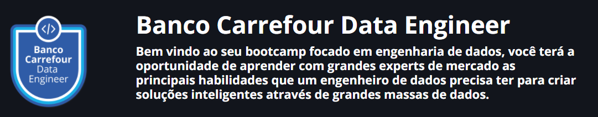

  

#### Bootcamp - Banco Carrefour Data Engineer

##### Este repositório refere-se as anotações e projetos desenvolvidos durante os cursos:

*  Introdução ao Git

*  Linux - A introdução ao sistema operacional 

* Shell script - Manipulando Arquivos

* Introdução a Ciência de Dados

* Fundamentos de Arquitetura de Sistemas

* Arquitetura de Sistemas Avançado

* Introdução a Orquestração de Contêineres com Docker

* Conceitos e Melhores Práticas com Bancos de Dados PostgreSQL

* Introdução ao MongoDB e Banco de Dados NoSQL

* Introdução à Programação com Python

* Segurança da informação com Python

* Fundamentos de ETL com Python

* Soluções Aritméticas em Python

* Monitoramento de clusters Hadoop de alto nível com HDFS e YARN

* Orquestrando ambientes de Big Data distribuídos com Zookeeper, Yarn e Sqoop

* Como realizar consultas de maneira simples no ambiente complexo de Big Data com Hive e Impala

* Processando grandes conjuntos de dados de forma paralela e distribuída com Spark

* Criando pipelines de dados eficientes com Spark e Python

* Análise de dados com Python e Pandas

* Solucionando Desafios em Python

* Criando um Ecossistema Hadoop Totalmente Gerenciado com Google Cloud Dataproc
